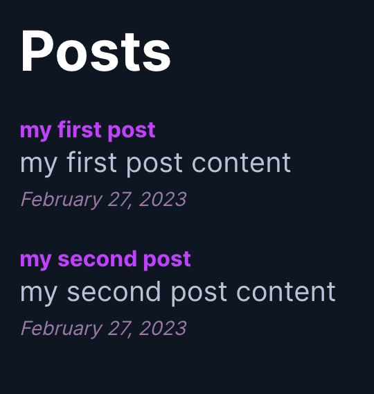

# Strapi Next.js

This is a starter template for a [Strapi](https://strapi.io) and [Next.js](https://nextjs.org/) application

> Note: this template is a simple static blog that uses Strapi as a backend and Next.js as a frontend. It is not a full-fledged application

#### Screenshot

## Getting started

- clone this repository and `cd` into it
- cd into the `backend` folder and run `npm install` to install the backend dependencies
- run `npm run develop` in the `backend` folder to start the Strapi server
- cd into the `frontend` folder and run `npm install` to install the frontend dependencies
- run `npm run dev` in the `frontend` folder to start the Next.js server

### Tips

> If you want to deploy this app you need to add your strapi domain name in the `frontend/config/server.ts` file
> Try also to add your strapi domain name in the `backend/config/server.js` file

## Resources

- [Strapi](https://strapi.io)
- [Next.js](https://nextjs.org/)
- [Jamstack](https://jamstack.org/)
- [Jamstack wiki](https://en.wikipedia.org/wiki/Jamstack?useskin=vector)
